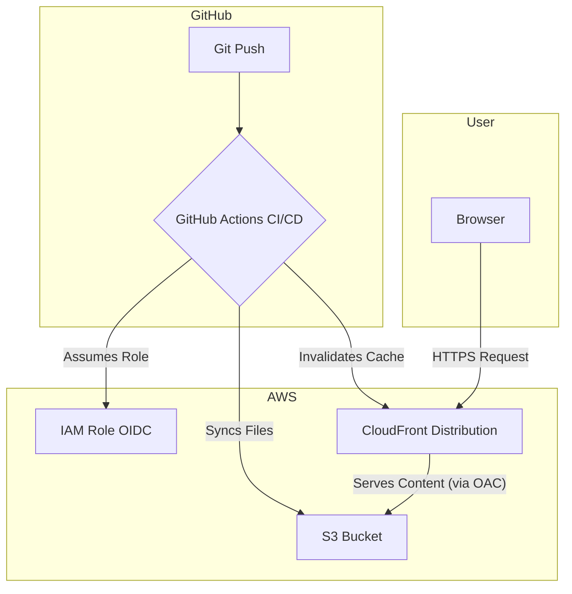

# Automated AWS Portfolio with CI/CD

[](https://github.com/janmaaarc/portfolio-website/actions/workflows/deploy.yml)

This repository contains the source code for my personal portfolio website. It showcases my projects and demonstrates modern cloud engineering practices. The infrastructure is defined as code using Terraform and deployed automatically via a GitHub Actions CI/CD pipeline to a secure and globally distributed AWS environment.

---

## Tech Stack

| Category         | Technologies Used                       |
|-----------------|----------------------------------------|
| Front-End        | HTML5, CSS3, JavaScript                 |
| Back-End / Cloud | AWS S3, CloudFront, AWS IAM, Terraform      |
| CI/CD            | GitHub Actions                           |
| Programming      | Python  |

---

### Key Features

*   **Dynamic Content**: Typing animation, collapsible work experience sections, and “view more” for certificates.
*   **Modern UI/UX**: Light/dark mode, smooth scroll animations, and floating navigation.
*   **Fully Responsive**: Works seamlessly on all screen sizes.
*   **Infrastructure as Code (IaC)**: Managed with Terraform.
*   **Automated CI/CD**: GitHub Actions deploys updates to S3 and invalidates CloudFront cache automatically.
*   **Secure & Performant**: S3 and CloudFront with private OAC (Origin Access Control) ensures security and global delivery.


---

## Built With

The project is built with a combination of modern front-end technologies and a robust cloud infrastructure.

### Front-End

*   **HTML5**
*   **CSS3**: With custom properties for theming and responsive design.
*   **JavaScript**: For interactive elements like the theme toggle, animations, and collapsible content.

### Back-End & Infrastructure (AWS)

*   **Terraform**: For defining and provisioning all cloud resources.
*   **GitHub Actions**: For orchestrating the CI/CD pipeline.
*   **Amazon S3**: To host the static website files.
*   **Amazon CloudFront**: To serve as the Content Delivery Network (CDN), providing low-latency delivery and security.
*   **AWS IAM**: To create a secure OIDC connection between GitHub Actions and AWS, allowing for passwordless deployments.

---

## Infrastructure Architecture

The infrastructure is designed for security, scalability, and performance, following AWS best practices.

1.  **GitHub Actions**: The CI/CD pipeline is triggered on a push to the `main` branch.
2.  **IAM Role (OIDC)**: The workflow authenticates with AWS using a temporary role, avoiding the need for static access keys.
3.  **Terraform**: Provisions the necessary AWS resources as defined in the `.tf` files.
4.  **Amazon S3**: The workflow uploads the built static files (`index.html`, `style.css`, etc.) to a private S3 bucket.
5.  **Amazon CloudFront**: Serves the content from the S3 bucket to users worldwide. It is configured with an **Origin Access Control (OAC)**, ensuring the S3 bucket is not publicly accessible.
6.  **CloudFront Invalidation**: After the files are uploaded, the pipeline creates a CloudFront invalidation to ensure users receive the latest version of the site immediately.



---

## Front-End Development
To run the front-end locally, clone the repository and open the `index.html` file in your browser.

```sh
git clone https://github.com/janmaaarc/portfolio-website.git
cd portfolio-website
# On macOS, you can use:
open index.html
# On Windows, you can use:
start index.html
```

---

## Infrastructure Deployment with Terraform

This project uses Terraform to manage all AWS resources. You can deploy the entire infrastructure from your local machine.

### Prerequisites

*   An AWS account with credentials configured for your terminal.
*   Terraform CLI installed.
*   A GitHub repository where you've forked this project.

### Steps

1.  **Navigate to the Terraform directory:**
    ```sh
    cd terraform
    ```

2.  **Update the IAM Role for Your Repository:**
    In `main.tf`, find the `aws_iam_role.github_actions_role` resource. You **must** update the condition to point to your own GitHub repository. This is a critical security step that ensures only your repository's workflows can assume this role.
    ```hcl
    # In main.tf, change this line:
    "token.actions.githubusercontent.com:sub": "repo:YOUR_GITHUB_USERNAME/YOUR_REPO_NAME:*"
    ```

3.  **Initialize and Deploy:**
    Run the standard Terraform commands to provision the resources on AWS.
    ```sh
    terraform init
    terraform plan
    terraform apply
    ```

---

## File Structure

```
.
├── .github/workflows/  # GitHub Actions CI/CD pipeline for deployment.
│   └── deploy.yml
├── certificates/       # Contains certificate image files.
├── images/             # Contains static images and logos for the website.
├── terraform/          # All Terraform files for Infrastructure as Code (IaC).
│   ├── main.tf         # Defines AWS resources (S3, CloudFront, IAM OIDC).
│   ├── variables.tf    # Input variables for Terraform configurations.
│   └── outputs.tf      # Output values from Terraform (e.g., CloudFront domain name).
├── .gitignore          # Specifies intentionally untracked files to ignore.
├── README.md           # This documentation file.
├── index.html          # The single-page HTML file for the portfolio.
├── script.js           # JavaScript for dynamic features and animations.
└── style.css           # CSS for styling the website.
```

---

## License

Distributed under the MIT License. See `LICENSE` for more information.

---

## Contact

*   **Jan Marc Coloma** - https://www.linkedin.com/in/janmarccoloma/
*   **Project Link** - https://github.com/janmaaarc/portfolio-website
