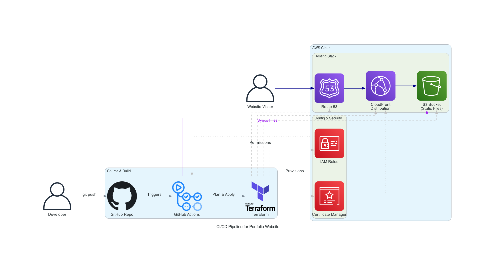
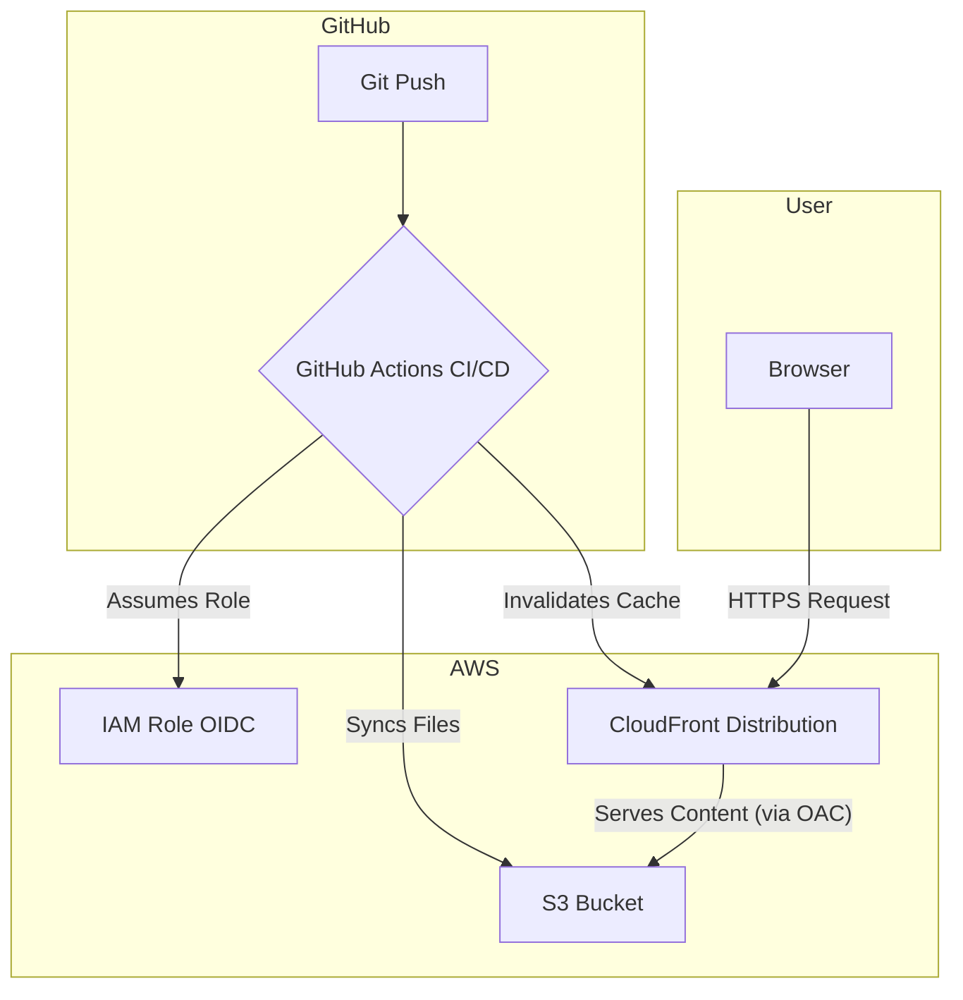

# Personal Portfolio Website & Automated AWS Deployment

[](https://github.com/janmaaarc/portfolio-website/actions/workflows/deploy.yml)

This repository contains the source code for my personal portfolio website. It's not just a showcase of my projects, but also a demonstration of modern cloud engineering practices. The entire infrastructure is defined as code using **Terraform** and deployed automatically via a **GitHub Actions CI/CD pipeline** to a secure and globally distributed **AWS** environment.

**Live Site:** [d1pb9ceg4g88xe.cloudfront.net](https://d1pb9ceg4g88xe.cloudfront.net)



---

## About The Project

This is a fully responsive, single-page portfolio designed to showcase my skills and projects as a Cloud Engineer. It features a clean, modern aesthetic with a focus on user experience and technical excellence, both on the front-end and the back-end.

### Key Features

*   **Dynamic Content**: Includes a typing animation, collapsible sections for work experience, and a "view more" feature for certificates.
*   **Modern UI/UX**: Features a light/dark mode theme toggle, smooth scroll-based animations, and a floating navigation dock.
*   **Fully Responsive**: Adapts seamlessly to all screen sizes, from mobile phones to desktop monitors.
*   **Infrastructure as Code (IaC)**: The entire AWS infrastructure is managed declaratively using Terraform.
*   **Automated CI/CD**: Every `git push` to the main branch automatically triggers a GitHub Actions workflow that syncs the website files to S3 and invalidates the CloudFront cache.
*   **Secure & Performant**: Hosted on S3, distributed globally via CloudFront CDN, and secured with an OAC (Origin Access Control) to keep the S3 bucket private.

---

## Built With

The project is built with a combination of modern front-end technologies and a robust cloud infrastructure.

### Front-End

*   **HTML5**
*   **CSS3**: With custom properties for theming and responsive design.
*   **JavaScript**: For interactive elements like the theme toggle, animations, and collapsible content.

### Back-End & Infrastructure (AWS)

*   **Terraform**: For defining and provisioning all cloud resources.
*   **GitHub Actions**: For orchestrating the CI/CD pipeline.
*   **Amazon S3**: To host the static website files.
*   **Amazon CloudFront**: To serve as the Content Delivery Network (CDN), providing low-latency delivery and security.
*   **AWS IAM**: To create a secure OIDC connection between GitHub Actions and AWS, allowing for passwordless deployments.

---

## Infrastructure Architecture

The infrastructure is designed for security, scalability, and performance, following AWS best practices.

1.  **GitHub Actions**: The CI/CD pipeline is triggered on a push to the `main` branch.
2.  **IAM Role (OIDC)**: The workflow authenticates with AWS using a temporary role, avoiding the need for static access keys.
3.  **Terraform**: Provisions the necessary AWS resources as defined in the `.tf` files.
4.  **Amazon S3**: The workflow uploads the built static files (`index.html`, `style.css`, etc.) to a private S3 bucket.
5.  **Amazon CloudFront**: Serves the content from the S3 bucket to users worldwide. It is configured with an **Origin Access Control (OAC)**, ensuring the S3 bucket is not publicly accessible.
6.  **CloudFront Invalidation**: After the files are uploaded, the pipeline creates a CloudFront invalidation to ensure users receive the latest version of the site immediately.



---

## Front-End Development

To run the front-end locally, you only need a web browser.

1.  Clone the repository:
    ```sh
    git clone https://github.com/janmaaarc/portfolio-website.git
    ```
2.  Navigate to the project directory and open `index.html`:
    ```sh
    cd portfolio-website
    # On macOS
    open index.html
    # On Windows
    start index.html
    ```

---

## Infrastructure Deployment with Terraform

This project uses Terraform to manage all AWS resources. You can deploy the entire infrastructure from your local machine.

### Prerequisites

*   An AWS account with credentials configured for your terminal.
*   Terraform CLI installed.
*   A GitHub repository where you've forked this project.

### Steps

1.  **Navigate to the Terraform directory:**
    ```sh
    cd terraform
    ```

2.  **Update the IAM Role for Your Repository:**
    In `main.tf`, find the `aws_iam_role.github_actions_role` resource. You **must** update the condition to point to your own GitHub repository. This is a critical security step that ensures only your repository's workflows can assume this role.
    ```hcl
    # In main.tf, change this line:
    "token.actions.githubusercontent.com:sub": "repo:YOUR_GITHUB_USERNAME/YOUR_REPO_NAME:*"
    ```

3.  **Initialize and Deploy:**
    Run the standard Terraform commands to provision the resources on AWS.
    ```sh
    terraform init
    terraform plan
    terraform apply
    ```

---

## License

Distributed under the MIT License. See `LICENSE` for more information.

---

## Contact

*   **Jan Marc Coloma** - https://www.linkedin.com/in/janmarccoloma/
*   **Project Link** - https://github.com/janmaaarc/portfolio-website